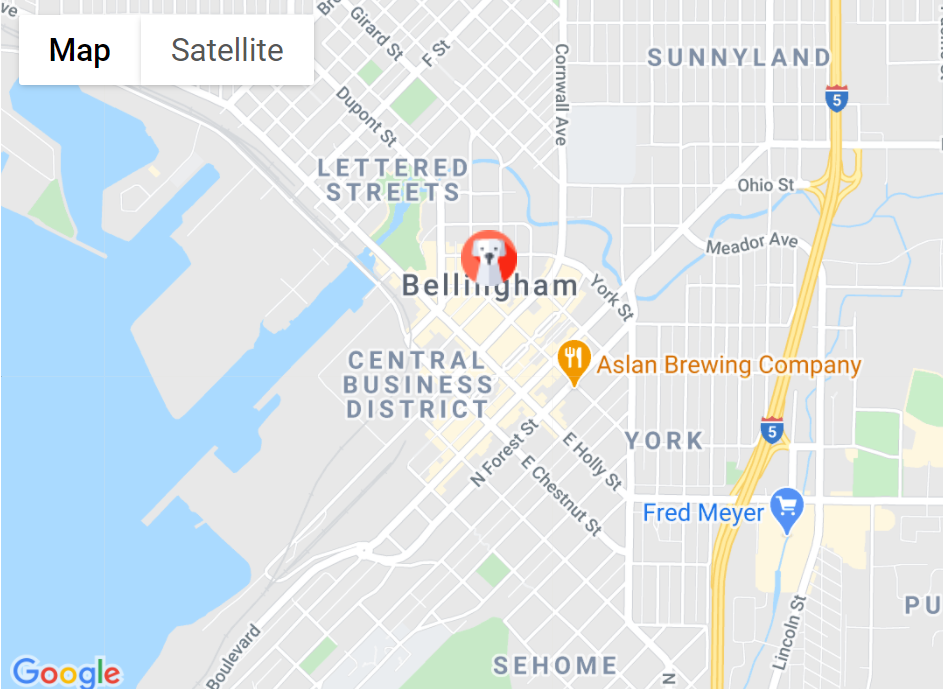

<h1 align = "center"> Pet Friendly

<h2 align = "center"> Developer : Brittany Lindgren
<br>
<br>

<h1 align = "center">


<h3 align = "center"> <u>Description</u>

If you've ever had to spend hours in front of your computer sifting through different hotel sites or sat in a car wondering if you were allowed to take your dog inside with you, you've felt the pain of traveling with your fuzzy loved one. PetFriendly's goal is to make your life easier by displaying all of the pet friendly shops, restaurants and hotels in one location, with easy to see details about each place. Wondering if you can take your pet into that ice cream shop? Check PetFriendly! Trying to find a cheese shop, bottle shop or boutique where you can take your loved one with you? Check PetFriendly! Once you're signed in (for free!) you can create trips and save future destinations or favorites to your trips so that they're all in one easy to find place in your app. You can also leave reviews and rate how pet friendly each location was, to make it easier for future travelers to decide where they want to go. Try PetFriendly today so that you can stop stressing and start relaxing with your pet!
<br>
<br>
<br>
<h1 align = "center">

## <p align = "center">  <u>**Project Proposal**</u>
|  |  | 
| ----- | ----- | 
|  Target demographic  |  Pet owners, people who can't leave their pet at home, someone who has their vacation planned and finds out last minute that their friend or pet sitter can't take care of their pet for them, someone who has a family emergency and has to leave quickly with their pet. User ages most likely between 20 and up - old enough to own a pet autonomously  | 
| What problems does this app solve  | Looking for pet friendly places takes a long timee, there are many different hotels or vacation services and some allow pets while others do not, users would have to look at each separate place individually and then use each location's filter to find a pet friendly option, then to compare prices would have to repeat that process. During a vacation, a user may not be sure if a certain shop is pet friendly or not. If a user does not have a friend or partner to stay with their pet, it may be unsafe for them to leave their pet outside, or they may not even have that option depending on the pet. Pet friendly will minimize timee and frustration spent searching for options and allow users to see if there are pet friendly businesses nearby so that they don't have to wonder whether or not they can take their pet inside with them.  |

<h1 align = "center">
<h1 align = "center">
<h1 align = "center">
<br>
<br>

### <p align = "center"> **MVC**
| Minimum Viable Product | What technologies or tools will be needed to achieve this MVP | Notes and Considerations |
| ----- | ----- | ------ |
|  Users should be able to create a 'destination' list on the MyTrips page and add destinations  |  React, Redux, Firestore / Firebase CRUD functionality  |  see stretch goals for further expansion on list capabilities  |
|  Users should be able to search by location and receive results for pet friendly restaurants, shops, hotels, etc.  |  Custom API / Pre-existing API (Google Maps, AirBnB, etc.) / .NET-Core backend to handle fetching from API  |  Integrating several APIs in one project may be complex. May need to begin with a single custom faux-API created as proof of concept and integrate other API as stretch goal.  |
|  Users should be able to add a location search result to a destination | Will need a database - MySQL, Firebase / Firestore or MongoDB  |  see stretch goals for further expansion on list capabilities  |
   
<br>
<br>

### <p align = "center"> **Stretch Goals**
| What additional features will be added | What technologies or tools will be needed | Notes and Considerations |
| ----- | ----- | ------ |
|  User will have full CRUD functionality for their 'trip' lists. Lists will auto populate with categories to which user can add search results  |  Database / Model and Controller in .NET backend  |  no further notes at this time  |
|  Users should be able to leave reviews / read reviews about how pet friendly each location is - this will help take the guesswork out of choosing a place to stay / eat / shop, etc.  |  Register / Login capabilities so that users have full CRUD functionality for their own reviews and read only for other users' reviews. Use React / Redux frontend *NOTE: Full CRUD functionality may be better suited to stretch goals than MVP, will prioritize other MVC items  |  no further notes at this time  | 
|  Map display of a search area  |  Google Maps API / Google Places API  |  limited number of API uses, then charged for each use  |
|  Use IP address to limit number of reviews per day or searches per second  |  ?  |  no further notes at this time  |
|  Infinite scroll or paginations to limit number of search results displayed  |  JavaScript / jQuery for infinite scroll or .NET-Core for pagination  | no further notes at this time  |
|  Email verification for new users  |  Firebase - custom email action handlers  |  no further notes at this time  |
|  Sign in with Google or Facebook account  |  Facebook and Google Authentication  |  no further notes at this time  |
|  Display login / register in a modal  |  CSS or Sass  |  no further notes at this time  |
|  Style the app  |  CSS or Sass  |  no further notes at this time  |
|  Users can add additional search parameters. For example `traveling with dog` and `require wheel chair access` or add more specific information about what type of pet they're traveling with, such as `dog` or `boa-constrictor`  |  Complex search queries  |  Firebase / Firestore may work well for MVP, but has limited query capabilities - need to research which databases work well with React and have complex query capabilities  |
|  Travel section where users can specify `1. Where they're traveling, 2. How they're getting there` and `3. What type of pet they're traveling with.` The user will then be shown or directed to information about what they need to know to successfully travel with their pet  |  will need to reseach options  |  no further notes at this time  |
|  Deploy site  |  will need to reseach options  |  may be able to deploy using Gatsby, but project not initially built with Gatsby, so may need other tools  |
|  Style google map  |  https://snazzymaps.com/explore, custom CSS  |  snazzy maps themes I like: https://snazzymaps.com/style/74/becomeadinosaur, https://snazzymaps.com/style/18/retro, https://snazzymaps.com/style/14889/flat-pale, https://snazzymaps.com/style/17/bright-and-bubbly - add a mapStyles.js file with code for styling map, import into component that holds map |
|  Users can add map icons to pet friendly places that are not yet in the API or database  |  google maps API |  Watch this tutorial from minute 12 to minute 16  |
|  Add animation to markers on map (ex: drop, bounce, etc)  |  google maps API  |  resource: https://developers.google.com/maps/documentation/javascript/markers  |
|  Add a GeoLocations button on map to pan to user's location if user gives permission  |  google maps API + GeoLocation API  |  resource: https://youtu.be/WZcxJGmLbSo @ minute 43:48  |
|    |    |    |

### <p align = "center"> **Model**

<h1 align = "center">

### Attributes for Figma Component Model above
1. For airplane vector icon 
* Icons made by <a href="https://www.flaticon.com/authors/good-ware" title="Good Ware">Good Ware</a> from <a href="https://www.flaticon.com/" title="Flaticon"> www.flaticon.com</a>
2. For dog image
* <span>Photo by <a href="https://unsplash.com/@ben_wong_31?utm_source=unsplash&amp;utm_medium=referral&amp;utm_content=creditCopyText">Benjamin Wong</a> on <a href="https://unsplash.com/s/photos/pets-travel?utm_source=unsplash&amp;utm_medium=referral&amp;utm_content=creditCopyText">Unsplash</a></span>
3. Search icon
* Icons made by <a href="https://www.flaticon.com/authors/freepik" title="Freepik">Freepik</a> from <a href="https://www.flaticon.com/" title="Flaticon"> www.flaticon.com</a>  
<br/>
<br/>

## <p align = "center">  <u>**Set Up on Your Local Machine**</u>
1. Clone project from github using the green `Code` button on the [project github page](https://github.com/LINDGRENBA/petFriendly)
2. Open in an IDE / Text Editor such as Visual Studio Code
3. Open the terminal. In Visual Studio Code you can do this by selecting `terminal` at the top of the IDE, then selecting `New Terminal` OR by entering `ctrl + shift + ~` on the keyboard.
4. Check that you are in the main directory by typing `pwd` and hitting `Enter`. The file path should look like this `/c/Users/blindgren/Desktop/EPICODUS/Full Time Bootcamp/Capstone3/pet-friendly`. If you are not in the main directory, navigate to main directory by typing `cd Pet-Friendly` in the terminal and hitting `Enter`.
5. Enter the following commands, in order to install, build and run the application :
* `npm install`  (This command is only necessary the first time you open the project on your computer. It may take several minutes for the install to complete - this is normal)
* `npm start` - in order for the project to start and function properly, you will need to set up a Firebase database, add your credentials and use a Google Maps API. The steps directly below will walk you through this process.

## <p align = "center">  <u>**Set Up a Firebase Database**</u>
You will need to set up a database in order for this project to run on your local machine. Follow the steps below.
1. Go to the [Firebase site](https://firebase.google.com/), click on `Get Started` and follow the steps to log into a Google account or create a Google account if you do not already have one.
2. After creating an account you should be directed to the Firebase console. If you have not been directed to the console, select the `Go to Console` link in the upper right. Now you'll create a project with the following steps.
  * Select `Create a Project` and enter `PetFriendly` as the project name, then click the `Continue` button.
  * Deselect the option to add Google Analytics to the project.
  * Once the project is created and you are redirected, select the `</>` button on the page.
  <p align = "center">

  * Enter a nickname for your project (this can be the same as the name you originally chose for the project) and click `Register App`.
  * You will see a list of credentials. The part that you will need is the following, but with your personal unique credentials as the values on the right. 
  ```
      apiKey: "YOUR-UNIQUE-CREDENTIALS",
      authDomain: "YOUR-PROJECT-NAME.firebaseapp.com",
      databaseURL: "https://YOUR-PROJECT-NAME.firebaseio.com",
      projectId: "YOUR-UNIQUE-PROJECT-NAME",
      storageBucket: "YOUR-UNIQUE-URL",
      messagingSenderId: "YOUR-UNIQUE-CREDENTIALS",
      appId: "YOUR-UNIQUE-APPID"
  ```
    
  You will be able to access this information later from the console, but if you'd like, you can copy this information now and save it in a safe space. Do not publish this information where others can see. It is important to keep this information private.
  * Navigate to your project console. It will look something like this.
  <p align = "center">

  * Click on `Cloud Firestore` in the lefthand pane. You will see the following
  <p align = "center">

  Select `Start in test mode` and click `Next`.
  * Note that after thirty days, the automatically set rules will expire and at that point you will need so update the rules for this project if you are still using it.
  <p align = "center">

3. Now we will add your personal credentials (set by Firebase in the above steps) to the project. Follow the steps below.
* add a .env file to the root of your folder (the top directory). The filename should appear greyed out. This indicates that it will be visible only to you. Do not share your personal credentials.
<p align = "center">

* add your credentials to the .env file, see below (replace the value between the " " with your credential values)
```
REACT_APP_FIREBASE_API_KEY = "YOUR-UNIQUE-CREDENTIALS"
REACT_APP_FIREBASE_AUTH_DOMAIN = "YOUR-PROJECT-NAME.firebaseapp.com"
REACT_APP_FIREBASE_DATABASE_URL = "https://YOUR-PROJECT-NAME.firebaseio.com"
REACT_APP_FIREBASE_PROJECT_ID = "YOUR-PROJECT-FIREBASE-PROJECT-ID"
REACT_APP_FIREBASE_STORAGE_BUCKET = "YOUR-PROJECT-NAME.appspot.com"
REACT_APP_FIREBASE_MESSAGING_SENDER_ID = "YOUR-PROJECT-SENDER-ID"
REACT_APP_FIREBASE_APP_ID = "YOUR-PROJECT-APP-ID"
```

It is very important that you follow the `REACT_APP_FIREBASE...` format and naming convention as these are the variables that the rest of the application will look for in order to run.
<br>
<hr>

## <p align = "center">  <u>**Obtaining a Google Maps API key**</u>

In order to use the Google Maps feature, you will need an API key. Do not share your API key with anyone. The google maps platform has excellent documentation that will walk you through setting up an account and obtaining a key. 
1. [Getting started with Google Maps Platform](https://developers.google.com/maps/gmp-get-started) will walk you through setting up an account.
2. [Get an API Key](https://developers.google.com/maps/documentation/javascript/get-api-key) will walk you through setting up a project (you can name your project whatever you like - I've named mine PetFriendly) and obtaining a key.

To use all map features you will need to enable three APIs for your projecT: Maps JavaScript API, Places API and the Geocoding API.
<p align = "center">


3. Once you have enabled all three APIs for your API key, add the following to the .env file you set up in the previous section. You can add it below your Firebase credentials.

```
REACT_APP_GOOGLE_MAPS_API_KEY = "YOUR-GOOGLE-MAPS-API-HERE"
```
You should now be able to use all features of the app.

<br>
<br>

### <p align = "center"> **Known Bugs**
| Issue & Message | Solution |
| ----- | ----- | 
| When clicking 'Trip Details' button, page is not re-directed to TripDetails component | Continue further with project setup |
| Service: This API project is not authorized to use this API.  For more information on authentication and Google Maps JavaScript API services | Enable Geocoding API in PetFriendly google projects platform |
| Each child in a list should have a unique "key" prop. Check the render method of `SearchBox`. See https://fb.me/react-warning-keys for more information. `in ComboboxOption (at SearchBox.js:68), in SearchBox (at SearchMap.js:69), in div (at SearchMap.js:67), in Search (at SearchControl.js:20), in SearchControl (at App.js:18), in Route (at App.js:17), in Switch (at App.js:16), in Router (created by BrowserRouter), in BrowserRouter (at App.js:12), in App (at src/index.js:31), in ReduxFirestoreProvider (created by ReactReduxFirebaseProvider), in ReactReduxFirebaseProvider (at src/index.js:30), in Provider (at src/index.js:29)`   | update `v4()` in SearchMap component to `event.place_id` and update `id` in SearchBox component to `place_id` |

### <p align = "center"> **Planned Improvements**
1. Refactor CSS to use styled components as opposed to inline styling
2. Update UI/UX and styling


## <p align = "center">  <u>**Process and Decision Making**</u>
1. Read Documentation, decide which version of React to use
2. Will use React with Redux + ASP.NET Core 
3. Create new application using `dotnet new reactredux -o Pet-Friendly`
4. Note that documentation states project is initiated with two apps - ASP.NET Core and React. ASP.NET Core app is intended for data access, authorization and server-side concerns while React app (located in ClientApp subdirectory) is intended for all UI concerns.
5. Decided to create initial app using only React-Redux and Firebase as am not intending to deploy at this time. 


### <p align = "center"> **Timeline**
| Date | Log |
| ----- | ----- |
| September 25th 2020 |  8:00 am - use npx-create-react-app to set up application with gitignore and readme <br/> 8:30 am - begin to document in README <br/> 9:30 to approx 11:00 - read react documentation, read postresql documentation, watch videos on different databases to use with react, then remembered plan to use react-redux with asp.net <br/> 11:00 to noon - read documentation for react with asp.net, research project setup and use of api / authentication / etc. <br/> 1:00 - Look at resources posted in discord. <br/> 1:30 - Create new application (see step 3 in process and decision making) and transfer README content to new application.Read through article on react with ASP.NET Core https://www.red-gate.com/simple-talk/dotnet/asp-net/a-real-world-react-js-setup-for-asp-net-core-and-mvc5/ and then continue to follow along with react-redux with ASP.NET Core setup documentation https://docs.microsoft.com/en-us/aspnet/core/client-side/spa/react?view=aspnetcore-2.2&tabs=netcore-cli<br/> Successfully build and run project with boilerplate web template <br/> 2:00 to 5:00 - Work on wireframe and component design with Figma |
| October 2nd 2020 | 8:00 am - re-assess MVP and Stretch goals, consider structure of website in preparation to complete Figma wireframe.<br/> 8:30 am to 11:00 - am complete Figma wireframe for project (includes MVP and some Stretch) <br/> 11:00 to 3:02 - Observe and note how auto generated files are set up to understand how project front and back end are connected <br/> 3:00 to 5:00 - research CRUD functionality with React + ASP.Net Core Web Application |
| October 3rd 2020 | 11:30 to 12:30 - Set auto populated content on home screen to display: none, add own elements <br/> 12:30 to 12:45 - figure out how to set up custom Links, link to MyTripsControl and ProfileControl pages <br/> 1:00 to 1:15 - reconsider design to create more user friendly experience <br/> 1:15 to 1:50 - add static elements to home, mytrips and profile pages |
| October 4th 2020| 10:50 to 2:00 - Add state to MyTrips for Add Trips form, including first adding tests for reducers <br/> TBD to 5:00 - Research and implement connecting backend to Firebase server. |
| October 5th 2020 | 8:40 - Start new project using simple create-react-app command <br/> 8:40 to 10:00 - Set up new project <br/> All day - Create project with react, integrate redux, test and add firebase |
| October 6th 2020 | 9:30 to 11:00 - Add client side routing to project <br/> 11:00 to 1:30 - Research use of GoogleSearch and GoogleMap API to implement into project <br/> 2:00 to 10:00 - Follow along with tutorial to integrate google maps api into project |
| October 7th 2020 | Regular commits made from this point on |


## <p align = "center"> Documentation and Resources used for this project
* **https://docs.microsoft.com/en-us/aspnet/core/client-side/spa/react?view=aspnetcore-2.2&tabs=netcore-cli**
* https://reactjs.org/docs/getting-started.html
* https://docs.microsoft.com/en-us/aspnet/core/client-side/spa/react-with-redux?view=aspnetcore-2.2
* https://www.youtube.com/watch?v=da7pyc918jo
* https://www.youtube.com/watch?v=lW7DWV2jST0
* https://www.red-gate.com/simple-talk/dotnet/asp-net/a-real-world-react-js-setup-for-asp-net-core-and-mvc5/
* https://docs.microsoft.com/en-us/aspnet/core/client-side/spa/react?view=aspnetcore-2.2&tabs=netcore-cli
* https://youtu.be/NjN00cM18Z4
* https://create-react-app.dev/docs/getting-started/
* https://youtu.be/Zxf1mnP5zcw - TraversyMedia
* https://youtu.be/pRiQeo17u6c - TraversyMedia
* https://youtu.be/WZcxJGmLbSo - Leigh Halliday
  - minute 8 to 10 of video: how to add styling to map
  - minute 10: disable select map UI feature, customize map header with icon
  - minute 12: how to add event listener so user click adds icon and saves location to state
* https://codetheweb.blog/style-a-navigation-bar-css/


### Technologies used for this project
* Visual Studio Code IDE
* Git for Version Control
* Markdown for documentation
* Figma - design planning
* React with Redux
* ASP.NET Core
* Firestore / Firebase Database
* Google Maps, Google Places and GeoCode API
* npm


### License
This site is licensed under the MIT license
Copyright (c) 2020 Brittany A Lindgren

<br/>
<br/>

This project was bootstrapped with [Create React App](https://github.com/facebook/create-react-app).

## Available Scripts

In the project directory, you can run:

### `npm start`

Runs the app in the development mode.<br />
Open [http://localhost:3000](http://localhost:3000) to view it in the browser.

The page will reload if you make edits.<br />
You will also see any lint errors in the console.

### `npm test`

Launches the test runner in the interactive watch mode.<br />
See the section about [running tests](https://facebook.github.io/create-react-app/docs/running-tests) for more information.

### `npm run build`

Builds the app for production to the `build` folder.<br />
It correctly bundles React in production mode and optimizes the build for the best performance.

The build is minified and the filenames include the hashes.<br />
Your app is ready to be deployed!

See the section about [deployment](https://facebook.github.io/create-react-app/docs/deployment) for more information.

### `npm run eject`

**Note: this is a one-way operation. Once you `eject`, you can’t go back!**

If you aren’t satisfied with the build tool and configuration choices, you can `eject` at any time. This command will remove the single build dependency from your project.

Instead, it will copy all the configuration files and the transitive dependencies (webpack, Babel, ESLint, etc) right into your project so you have full control over them. All of the commands except `eject` will still work, but they will point to the copied scripts so you can tweak them. At this point you’re on your own.

You don’t have to ever use `eject`. The curated feature set is suitable for small and middle deployments, and you shouldn’t feel obligated to use this feature. However we understand that this tool wouldn’t be useful if you couldn’t customize it when you are ready for it.

## Learn More

You can learn more in the [Create React App documentation](https://facebook.github.io/create-react-app/docs/getting-started).

To learn React, check out the [React documentation](https://reactjs.org/).

### Code Splitting

This section has moved here: https://facebook.github.io/create-react-app/docs/code-splitting

### Analyzing the Bundle Size

This section has moved here: https://facebook.github.io/create-react-app/docs/analyzing-the-bundle-size

### Making a Progressive Web App

This section has moved here: https://facebook.github.io/create-react-app/docs/making-a-progressive-web-app

### Advanced Configuration

This section has moved here: https://facebook.github.io/create-react-app/docs/advanced-configuration

### Deployment

This section has moved here: https://facebook.github.io/create-react-app/docs/deployment

### `npm run build` fails to minify

This section has moved here: https://facebook.github.io/create-react-app/docs/troubleshooting#npm-run-build-fails-to-minify